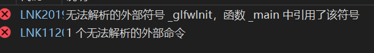
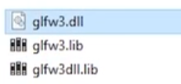

## C++中使用库(静态链接）:

预先编译的二进制文件：
下载第三方库我们可以下载源代码，和已经编译过的二进制文件。
对于源代码。我们只需要.h，.c就好。
对于预先编译的二进制，我们可以更快的使用它。

二进制文件的位数与我的目标应用程序有关。32位和64位并不是指和我的操作系统位数相关。

头文件包含函数的定义，library包含函数体。

具体操作流程：
首先下载完二进制文件后，在自己的解决方案文件夹中新创一个depenticies的文件夹，把第三方库安装到其中。
其次在解决方案属性中->C/C++-> General->
附加库连接。  提供include文件的根目录地址。

这代表我的连接不到位。没有正确连接到函数库。
最后我们应该在linker->常规和输入中找到附加库。常规中添加函数体的根部录。输入中添加一个需要的.lib文件（用；隔开）
这一步也可以是点击项目-》添加-》refence。而且这样会更好。

静态链接总是会把头文件预先编译到exe等可执行文件中。动态链接是在运行的时候进行连接，不会编译到可执行文件中。

## 使用动态库

下载的library中有这样三个文件。
第二个事静态链接。
第一个，第三个库动态链接。第三个库中包含的全是指向第一个库的指针。

怎么使用？
我们应该在linker->常规和输入中找到附加库。常规中添加函数体的根部录。输入中添加一个需要的.lib文件（用；隔开）
我们要在这一步换成glfwdlll.lib
其次，我们把我们的dll文件复制到可执行文件夹中（debug）等。