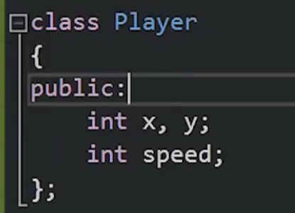
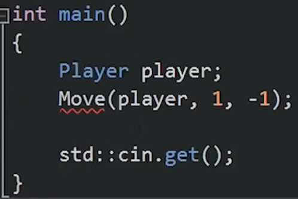

C++可以面对对象编程。面对对象编程需要有类与对象的概念。下面来介绍C++中的类。

## 类创造的原因：
类是把数据和功能集合在一起的新的数据类型。类可以使代码更加简洁，利于维护。例如利用普通C语言写游戏，如果有两个或多个角色，那么代码会十分换乱，冗长，不利于维护。 
记住，类不会给我任何新功能，我可以用类搞定的事情，不用类一样可以。类只是要我们代码更加简洁，好维护。
## 类的使用:
类的声明：

注意： 括号后要有分号；
   类中属性没有特别声明的话，都是私有变量（private），只有类中函数可以调用。在main中是调用不了的。如果需要再mian中访问变量的话，需要加public：

 在main中声明对象：

## 类与结构体的区别：
几乎没有区别，技术上来说 class默认是private的，struct默认是公开的。

## 创造类的顺序：
首先定义一个类，但是先不填空。在main函数中想好了这个类会实现什么功能，用什么变量再回去填空。
最好在private变量名前加个m_ 提醒我们这是个private类变量。
