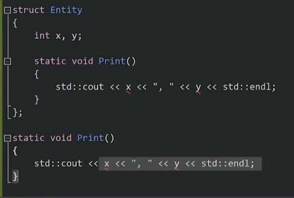
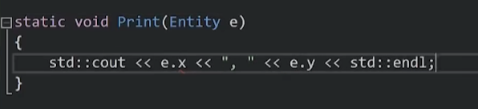
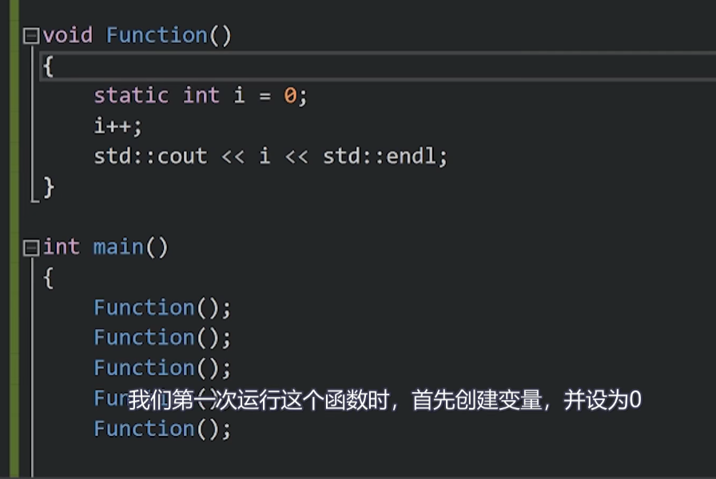
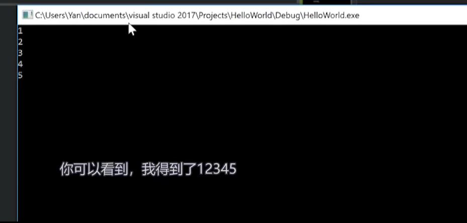

## 在类和结构体外使用static：
我们不能有两个同名的全局变量。
static修饰的变量和函数只有在它所在的编译单元可见。
和static相反的有一个extern关键词，声明这个变量后，告诉编译器，从其他文件找这个变量。
全局变量不好，尽量要使用静态变量，因为全局变量可能会带来可怕的bug。
## 在类和结构体中的static：
<font color= "#F33232">类中的static变量和方法不再是类的一员。这就像我们在名为Entity的命名空间中创造了两个变量，他们实际不属于类。但继承的时候会继承。</font>
两个不同实例（对象）中的static变量指向同一个内存。
<font color= "#F33232">在类中的static变量，在main中使用它的话需要在某个地方定义那些静态变量 </font>

```
int Entity::x    //先写作用域，在写变量名
```
如果使用的属性都是static 的，那么在main函数中可以不用实例了，用类名+：：+方法或者属性。 如：  Entity::print()
### <font color= "#374151">:: 在C++中的作用和命名空间的概念</font>
<font color= "#374151">在C++中，双冒号符号 "::" 表示作用域解析操作符（Scope Resolution Operator）。这个符号用于访问命名空间（namespace）、类（class）、结构体（struct）或枚举（enum）中的成员，包括变量、函数、类的成员等。</font>
<font color= "#374151">在C++中，命名空间（Namespace）是一种用于组织和管理程序中标识符（如变量、函数、类等）名称的机制，以防止名称冲突和命名污染。命名空间提供了一种将相关的标识符分组并引入程序的方式，使得它们在不同的上下文中可以有相同的名称，而不会发生冲突。</font>
```
// 定义一个命名空间
namespace MyNamespace {
    int myVariable = 42;
    
    void myFunction() {
        // 函数实现
    }
}

int main() {
    // 访问命名空间中的变量和函数
    int value = MyNamespace::myVariable;
    MyNamespace::myFunction();
    
    // 使用 using 声明引入命名空间的成员
    using MyNamespace::myVariable;
    int anotherValue = myVariable;
    
    return 0;
}
```
### <font color= "#374151">静态方法中不能调用非静态成员</font>
原因是静态方法没有类实例。
类中写的每个非静态方法总是获得当前类的一个实例作为参数，这在类中是看不到的，是背后的运行方式，他们通过隐藏参数发挥作用。
静态方法得不到那隐藏参数，<font color= "#F33232">静态方法就和类外方法一样</font>。



非静态方法相当于：，


## 调用static变量和方法的正确方法
假设类是Entity，那么是：
```
Entity::a;
Entity::print();
```

## 局部作用域的static：
例如在函数中：创造一个static变量，你反复调用这个函数时，它不会重新创造新的变量。此时，可以看做这个变量是在函数外定义的全局变量，有一定的相似，但是又有很大不同。
我们想要函数的某个变量像全局变量一样，值会保留，重新调用函数不会重新创造这个变量。同时又不想别的方法能随便调用这个变量，那么我们可以在函数内部定义static变量。




如果函数类的变量没有static的话，它会在栈上创立，当函数作用域结束时，变量会被销毁。有static的话，作用域是永远。