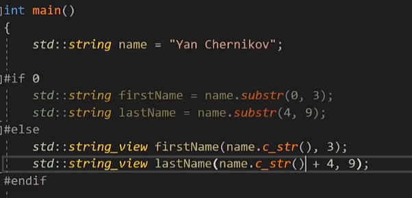

String喜欢在堆上分配内存，在堆上分配内存会减缓程序性能，会导致cache miss。
当函数需要 string的子串的时候，我们使用string。substr获得子串的时候会默认进行一个拷贝（即一次string创建），浪费空间
string_view 获得子字符串时，直接对字符串的内存进行应用，不需要多拷贝一下。
string_view(首地址，末地址）

## SSO，小字符串优化。
C++定义了一个规则：
如果我有一个不超过一定长度的字符串，它不会在堆上进行堆分配。而是使用栈缓存区