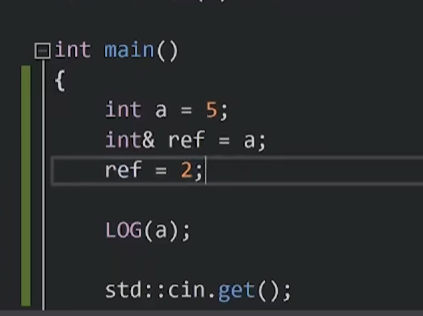
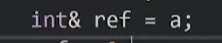
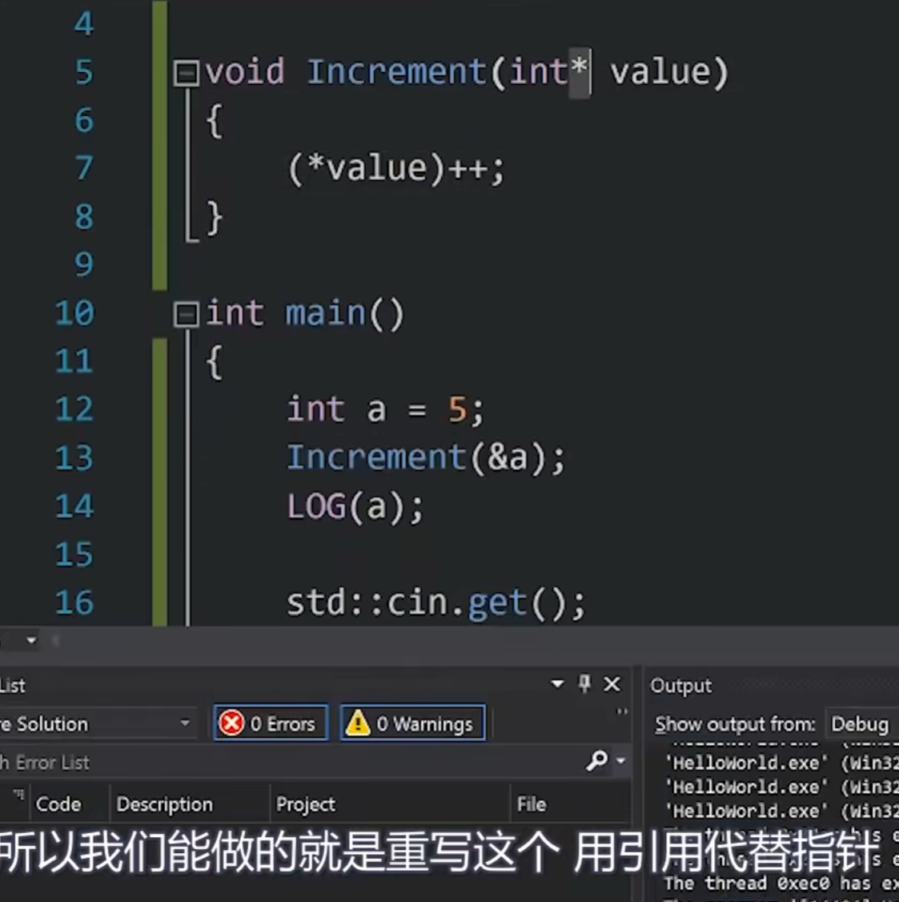
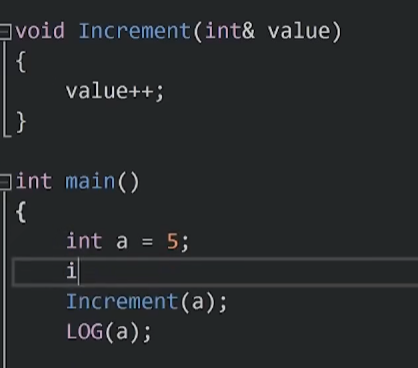

<font color= "#222222">  引用在开始的时候就绑定到了一个内存空间(开始必须赋初值)  所以引用本身就是指针的伪装。</font>
引用不像指针一样能够首先声明，然后赋空值。它本身也不占内存。<font color= "#222222">不存在指向空值的引用，但是存在指向空值的指针</font>




这就是引用：

ref不是变量，它不占内存，它同时可以理解为a内存空间的名字和a的别名，对ref进行操作实际上就是对a进行操作。和指针对比来说，指针操作有许多的要求，如*。对引用的操作和对变量的操作一模一样，没有区别。
<font color= "#222222">  引用在开始的时候就绑定到了一个内存空间(开始必须赋初值),所以他只能是这个内存空间的名字,而不能改成其他的,当然可以改变这个内存空间的值。【引用指向某个对象之后就不可以改变，指针可以改变其所指的值】。</font>
## 引用代替指针：





引用本身就是绑定了内存空间。
例子：
引用不能够起初引用变量a，后续改为引用B变量。 这样不可行，实际意义为给a变量赋值为b变量的值。
```
int main()
{
    int a = 8;
    int b = 5;
    
    int& ref = a;
    ref = b;
}
```

当我使用引用的时候，必须马上赋值，因为它必须引用一些东西，记住它不是一个真正变量。

<font color= "#343541">std::unordered_map<TreeNode*, int> memo;</font>
        return robInternal(root, memo);    这里要求输入一个引用，为什么可以直接输入memo？
在这段代码中，<font color= "#000000">**robInternal**</font> 函数的参数 <font color= "#000000">**std::unordered_map<TreeNode*, int>& memo**</font> 要求传入一个 <font color= "#000000">**std::unordered_map**</font> 类型的引用，而不是直接传入 <font color= "#000000">**memo**</font> 这个对象。然而，在这里可以直接传入 <font color= "#000000">**memo**</font> 对象，而不需要显式地使用引用传递，因为C++支持隐式引用传递。
当您在函数调用中传递一个对象时，C++编译器会自动执行引用传递（如果函数参数声明为引用的话）。这是因为C++的参数传递规则允许编译器将对象传递给函数，并在函数内部将其视为引用，以便函数可以直接访问和修改对象，而不必进行拷贝。
所以，虽然函数参数声明为 <font color= "#000000">**std::unordered_map<TreeNode*, int>& memo**</font>，但您仍然可以直接传递 <font color= "#000000">**memo**</font> 对象，C++编译器会隐式地将其视为引用传递，允许函数内部修改 <font color= "#000000">**memo**</font> 对象。
这种隐式引用传递的方式使代码更加简洁，并且提供了良好的可读性，因为它不需要显式地传递引用符号 <font color= "#000000">**&**</font>，但实际上仍然传递了引用。这是C++语言中的一个方便之处。