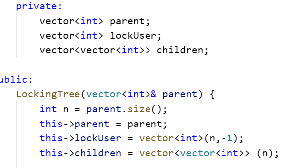
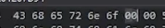
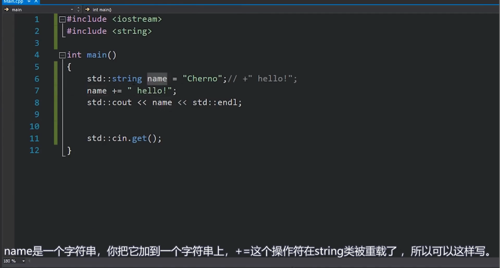
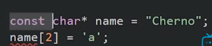
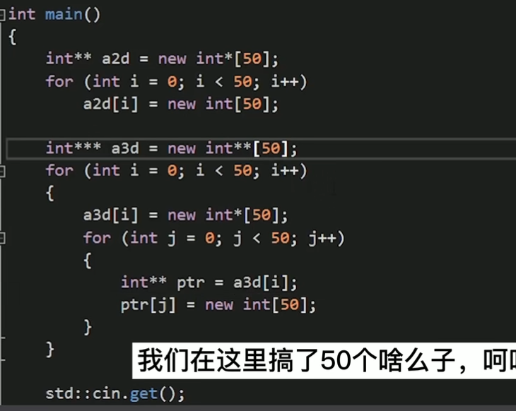

## 数组：
数组与指针密不可分。数组实际上就是指针。

数组名就是数组的首元素地址。
数组的创建：
```
int example[5] 在栈上创立。
int* another = new int[5];//类比malloc，在堆上创立。
```

内存间接寻址：例如：
```
#include<iostream>
#include<string>

class Entity
{
public:
	int* example = new int[5];

	Entity()
	{
		for (int i = 0; i < 5; i++)
			example[i] = 2;
	}
};

int main()
{
	Entity e;

	std::cin.get();
}
```
我们在类中定义了数组，它调用数组时会先去e的地址找，e的地址中包含另一个地址，是我们数组实际的内存地址。所以类调用数组就是内存间接寻址，肯定会浪费性能。

std::array也可以创造数组，且比原始方法安全的多，有边界检查。


vector 数组，
我们可以这样初始化它们。


```
 children[p].emplace_back(i); // 也可以这样插入元素，
                                当然这是二维数组
```

## 字符串
我们经常使用const char* 表示字符串，const代表这字符串不会改变了。
数组名本身就是地址。


在内存中，00就是空终止字符，字符串结束的地方  。
```
char* cherno = "cherno";
这是个字符串，直接赋值，会自动天剑终止符。
如果是原始的赋值方法，则不会。
```
在C++中 使用字符串，要学会使用std::string.
在字符串中添加字符串：


指针直接+=；

## 字符串自变量
字符串自变量是在双引号之间的一串字符。
在计算字符串字面量的长度的时候，我们要注意转义符\的存在。


这是不适用的，首先这不能达到我们的目的，其次，这在一些编译器可能无法使用。
<font color= "#111111">我们要打印的东西有很多的行的字符串，我们就可以是两种方法：</font>
<font color= "#111111">在C++中，当你在两个双引号之间的字符串后面紧接着写另一个双引号之间的字符串，编译器会自动将它们拼接在一起。这就是为什么你可以将字符串写成这样的原因：</font>
```
const char* ex = "Line1\n"
		"Line2\n"
		"Line3\n";
```

我们也可以这么做：
```
const char* ex = R"(line1
line2
line3)";
```
R可以方便我们输出多行或有引号的字符串。
1. 多行字符串
：在传统的字符串表示方法中，如果我们想要表示一个跨越多行的字符串，我们需要在每一行的末尾添加**\n**来表示换行，并且还需要使用**+**或者**"**来连接每一行。这样做既繁琐又容易出错。但是，如果使用原始字符串字面量，我们可以直接将多行字符串放在**R"()"**中，编译器会自动处理换行和连接的问题。
1. 含有引号的字符串
：在传统的字符串表示方法中，如果字符串中包含引号，我们需要使用**\**来转义引号，例如**"\"Hello, World!\""**。这样做既不直观又容易出错。但是，如果使用原始字符串字面量，我们可以直接将含有引号的字符串放在**R"()"**中，编译器会自动处理引号的问题。


字符串子面量永远保存在内存的只读区域内，是永远。所以字符串字面量是不可以被修改的。

## 多维数组：
多维数组有什么不同？
例如，二维数组就是数组的数组。每一个二维数组就是一个存储了一维数组的指针的一维数组。


多维数组存储在堆上，容易造成cache miss，查找内存的效率变低。