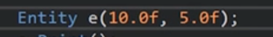
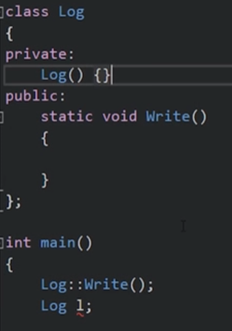
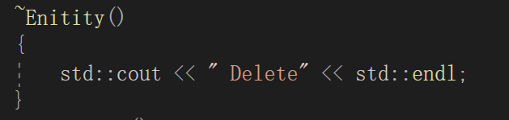
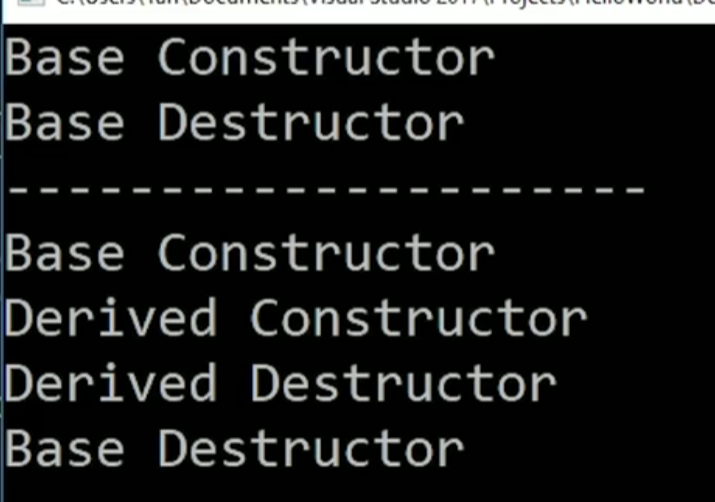

## 构造函数

构造函数是一个每次构造实例对象的时候都会调用的方法，它的名字和类名一样，没有返回值类型。它的主要用途是初始化参数。
在实例化类的过程中，我们只为变量创造了内存，没有初始化内存。在java中数据基本类型会自动初始化为0，但c++不会这样。
如果构造函数需要参数时，参数应该在构造实例的时候传入：


如果我们不允许创造实例化对象，我们应该这么做：


因为我们不能访问构造函数了，C++为我们提供了默认的构造函数，这样做可以要我们访问不了构造函数，进而不能创造实例。

## 成员初始化列表
Entity()
:m_name ("cherno");{}
在：后列出初始化的成员。
需要注意的是，成员初始化的顺序必须是定义成员变量的顺序。

成员初始化列表的优势在于：
1.    代码简洁。
1.    避免了内存浪费。
 尽量用初始化列表。


## 析构函数
    析构函数是在对象要被销毁的时候调用。
析构函数的主要作用是消除占用的内存。


为了避免内存泄漏，析构函数十分重要的。

虚析构函数
当我们B类派生与A类时，当删除B类的时候，我们不想它调用A类的析构函数，想调用B类自己定义的析构函数，我们需要虚析构函数。




子类创建的时候，先创建父类。
子类销毁先销毁自己，在销毁父类

```
class Base
{
public:
	Base()
	{
		std::cout << " Base constructor\n";
	}

	~Base()
	{
		std::cout << "Base  destroyed\n";
	}
};

class Root : public Base
{
public:
	Root()
	{
		std::cout << " Root constructor\n";
	}
	
	
	~Root()
	{
		std::cout << " Root constructor\n";
	}
};
int main()
{
	Base* a = new Base();
	delete a;
	std::cout << "--------------\n";

	Root* b = new Root();
	delete b;
	std::cout << "--------------\n";

	Base* c = new Root();
	delete c;
}
```
这样的类型下，我们的C会造成调用错析构函数(调用 Base类的，而不是ROOT类）。可能造成内存泄漏；

在父类中加上：
virtual ~Base()
{
std::cout << "Base  destroyed\n";
}
但是说，和虚函数不同的是，不是会覆盖，而是会加上落下的析构函数，从而不会内存泄漏。