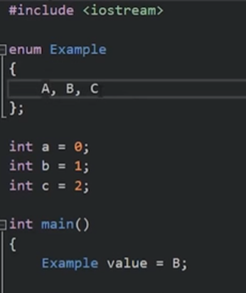

枚举就是一种命名值的方法。在程序中使用枚举时，我们可以通过枚举常量来代替数值，这样可以让程序更加清晰易懂，而且提高了代码的可维护性。
枚举背后就是整数，在我们想用整数来表示某些状态和数值时，枚举特别有用。

这个example类型的value变量只能是enum里面的一个。
enum里面变量会递增。如果没有特殊声明，enum的变量值是从0递增.
 枚举只能是整形变量。
enum不是一个命名空间。  
总之，有一个数值集合，并且我想用数字表示他们，枚举就是我想要的。