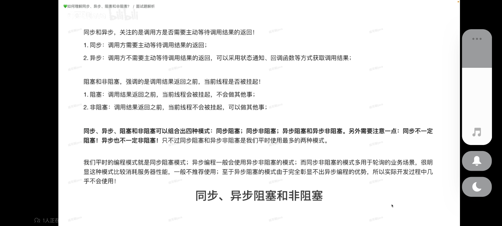
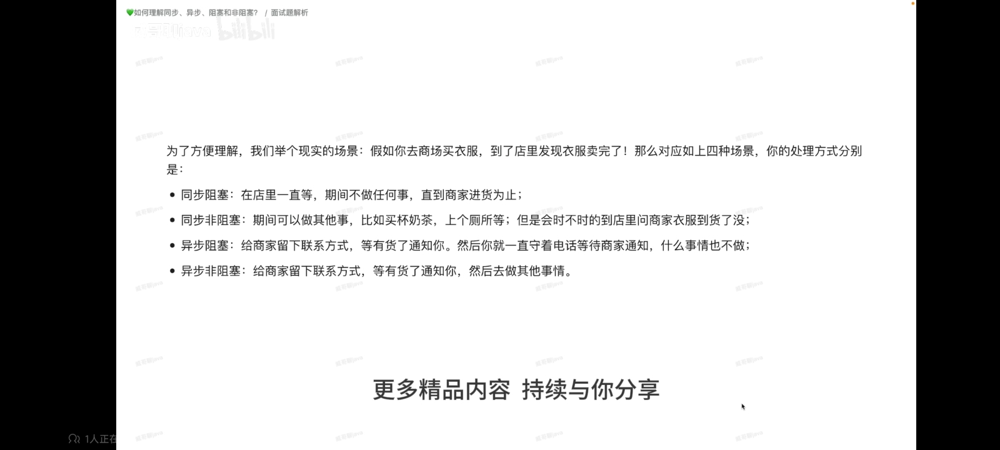

我们之前写的代码都是单线程的，我们计算机有多个逻辑线程。我们可以利用多线程来提高程序运行的效率。


http://t.csdnimg.cn/m0JJf
```
#include<iostream>
#include<vector>
#include<thread>
void DoWork()
{
	std::cout << "working....\n";
}

int main()
{
	std::thread worker(DoWork);//在这个线程中，执行DoWork这个函数任务

	worker.join();// 主线程会在此堵塞，等待worker执行完，并入主线程。

}
```


## 如何要C++变得更快
多线程编程可以使C++变得更快
多线程协作：
同步：主线程等待被调用线程处理完后再继续进行操作，是阻塞机制。调用方需要等待调用结果
异步：主线程不用等待，两者完全平行运行。
           不需要等待。状态通知和回调函数可以调取结果。
std::async(线程创建方式，可调用线程函数的名称，参数）
需要用std::future的类型来接受std::async的返回值，future类型可以得到异步线程的运行状态等消息。





