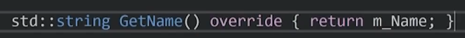

虚函数允许我们在子类中重写方法。如果我们在父类方法前加上virtual 则说明这个函数可以被子类重写。
例子代码中：
```
#include<iostream>
#include<string>

class Entity
{
public:
	std::string GetName()
	{
		return "Entity";
	}
};

class player:public Entity
{
private:
	std::string m_Name;
public:
	player(const std::string& name)
		:m_Name(name){}  // 这里是输入一个引用（即一个指针，就是一个字符数组，那么我们可以直接输入字符串的） 
                                      可以直接在构造函数后面加:表示
初始化列表，这里的意思为把name赋值给m_name;

	std::string GetName() { return m_Name; }

};

int main()
{
	Entity* e = new Entity(); //这里为什么是*？ 类比思考malloc就知道了。
	std::cout << e->GetName() << std::endl;//因为是指针，指针调用要用->，类比结构体。

	player* p = new player("cherno");
	std::cout << p->GetName() << std::endl;
	std::cin.get();
}
```
这个例子现在是正确的，但是当我们用多态的概念去理解，那就出现问题了。
player是Entity的子类，继承了它的所有东西，所以，player类型的指针也是一个Entity类型的指针。
```
void printName(Entity* entity)
{
	std::cout << entity->GetName() << std::endl;
}
int main()
{
	Entity* e = new Entity();
	printName(e);

	player* p = new player("cherno");
	printName(p);

	std::cin.get();
}
```
问题在于：此时，我明明使用的是player类型的指针p，但它同时也属于entity类的指针。当我调用player里重写的方法时，它不会调用重写后的方法，而是使用基类中的方法。
这是因为我们的参数是entity，系统只会在entity去找这个符合的方法。如果我们想要计算机意识到，我们传入的指针不仅仅是entity类型的，更是player类型的，我们想调用重写后方法，这就要用到虚函数，虚函数用到了动态联编的方法。它通过v表进行编译，v表包含了基类中所有虚函数的映射，这样在运行的时候，就可以找到正确的映射的覆写函数。
我们需要记住，如果需要覆写一个函数，那么我们必须把基类中的函数前加virtual，标记为虚函数。这样我们就可以确保子类想调用重写的方法时能正确调用。直接在家返回符号前。

我们也可以在被覆写函数后加上override，这不是必需的，但是增加了可读性，也能帮我们检查错误。
虚函数是需要消耗资源的，要消耗内存来存储v表，要消耗性能来查询v表，但是这些消耗很小很小，不用考虑。