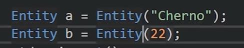

## 隐式转换：
这个一般不常用。

我们可以这样创造类对象，可以这样的原因是，它本身是个利用了构造函数的隐式转换。

本意是这样

这就是隐式转换，会根据你的类型去匹配类的构造函数，创造一个类，然后赋值。

需要注意的是，只能隐式转换一次。

这样就不行，因为要达到目的，需要转换两次。

## explicit：
在构造函数前使用explicit，意味着这个类将不能通过这.个构造函数完成隐式转换。